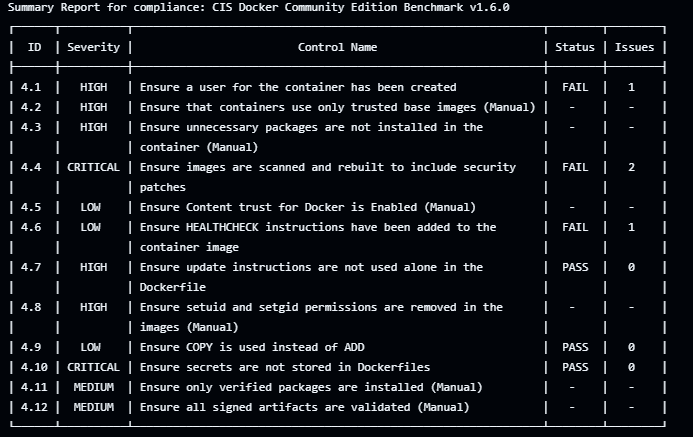
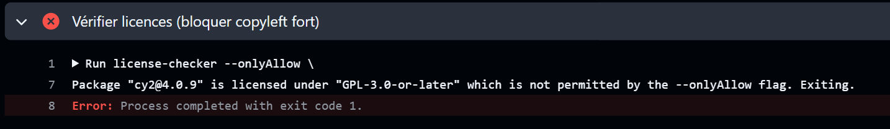
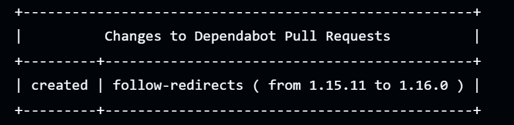

# Sécurisation Globale d'une Application 3-Tiers

## Architecture
compose.yml               → Stack applicative (traefik, api, web, db)
security/docker-compose.security.yml → Stack sécurité (falco, suricata, wazuh, shuffle)
.github/workflows/security_actions       → Pipeline CI/CD sécurisé
ansible/playbook.yml                 → Déploiement automatisé
security/falco/        → Règles Falco
security/suricata/     → Config + règles Suricata
security/yara/         → Règles YARA
security/sigma/        → Règles Sigma

## Lancer le projet localement avec Ansible

### Prérequis
```bash
apt install ansible python3-pip -y
pip3 install docker
ansible-galaxy collection install community.docker
```

### Déploiement complet
```bash
cd /Open-source-M2-cyber-2026
ansible-playbook ansible/playbook.yml
```

### Déploiement manuel (sans Ansible)
```bash
# 1. Stack applicative
docker compose up -d

# 2. Stack sécurité (dans un autre terminal)
cd security && docker compose -f docker-compose.security.yml up -d
```

## Vérifier que tout tourne
```bash
docker compose ps
cd security && docker compose -f docker-compose.security.yml ps
```

## Tests des règles de sécurité

### Tester Suricata (SQL Injection)
```bash
curl "http://localhost/api/users?id=1'+OR+'1'='1"
curl "http://localhost/api/users?id=1+UNION+SELECT+*+FROM+users"
```

### Tester Suricata (Path Traversal)
```bash
curl "http://localhost/api/../../../etc/passwd"
curl "http://localhost/%2e%2e/%2e%2e/etc/passwd"
```

### Tester Suricata (RCE)
```bash
curl "http://localhost/api/cmd?x=;whoami"
curl "http://localhost/api/cmd?x=|bash"
```

### Tester Falco (shell dans le conteneur backend)
```bash
docker exec -it api sh
# → Falco doit générer une alerte CRITICAL
```

## Voir les logs Wazuh

### Logs Falco remontés dans Wazuh
```bash
docker exec wazuh-manager tail -f /var/ossec/logs/alerts/alerts.json | grep -i falco
```

### Logs Suricata remontés dans Wazuh
```bash
docker exec wazuh-manager tail -f /var/ossec/logs/alerts/alerts.json | grep -i suricata
```

### Logs Traefik
```bash
docker exec traefik cat /var/log/traefik/access.log
```

### Dashboard Wazuh
Ouvre http://localhost:5601 → admin / SecretPassword123!

## Failles identifiées dans l'application

### 1. Injection SQL (backend/server.js)
Le backend construit les requêtes SQL par concaténation de chaînes sans paramètres préparés.
**Test :** `curl "http://localhost/api/users?id=1 OR 1=1"`
**Correction suggérée :** Utiliser des requêtes paramétrées avec `pg` (`$1, $2...`)

### 2. Pas de rate limiting
Traefik n'a pas de middleware de rate limiting configuré.
**Correction suggérée :** Ajouter le middleware `rateLimit` dans les labels Traefik.

### 3. API insecure exposée
L'API Traefik est désactivée (`--api.insecure=false`) ✅ déjà corrigé.

## Workflow Shuffle (SOAR)

Shuffle écoute sur http://localhost:3001
Le workflow reçoit les alertes Wazuh via webhook sur `http://localhost:3001/api/v1/hooks/`
Et envoie une notification (email/Slack) pour chaque alerte CRITICAL.

## Commandes utiles

```bash
# Voir les alertes Falco en temps réel
docker logs -f falco

# Voir les alertes Suricata en temps réel
docker exec suricata tail -f /var/log/suricata/eve.json | python3 -m json.tool

# Scanner les vulnérabilités avec Trivy
trivy image open-source-m2-cyber-2026-api

# Lancer YARA sur le code backend
yara security/yara/malicious_node.yar backend/
```


## Structure du pipeline
 
| Job | Outil | Objectif |
|-----|-------|----------|
| `npm-audit` | npm audit | Vulnérabilités des dépendances package.json -> Réalise par dependency bot externalisé de nos propre github actions |
| `license-check` | license-checker | Blocage des licences copyleft fort |
| `sbom` | CycloneDX + Trivy | Génération et analyse du SBOM applicatif |
| `trivy-image` | Trivy | Scan des images Docker + SBOM image |
| `iac-scan` | Trivy config | Mauvaises pratiques IaC (Docker Compose, YAML) |


## Choix techniques
 
**npm audit plutôt que Snyk/Dependabot** : natif Node.js, aucune dépendance externe, résultat immédiat sans token.
 
**CycloneDX npm** (`@cyclonedx/cyclonedx-npm`) : standard SBOM reconnu, compatible avec l'écosystème Trivy pour l'analyse downstream.
 
**license-checker avec liste d'allowlist** : plus fiable que les blocklists — on autorise explicitement les licences permissives, tout le reste est bloqué. Les licences copyleft fort bloquées sont : GPL-2.0, GPL-3.0, AGPL-3.0, LGPL-*.
 
**SARIF uploadé sur GitHub Security** : centralise tous les résultats dans l'onglet "Security > Code scanning" du repo sans outil tiers.
 
**Jobs séparés** : l'échec d'un scan n'empêche pas les autres de tourner, ce qui donne une vue complète des problèmes.


 ## Artefacts générés par le pipeline
 
| Fichier | Contenu |
|---------|---------|
| `sbom.json` | SBOM CycloneDX des dépendances npm |
| `sbom-image.json` | SBOM CycloneDX de l'image Docker buildée |
| `trivy-sbom.sarif` | Résultats SBOM au format SARIF |
| `trivy-image.sarif` | Résultats scan image au format SARIF |
| `trivy-iac.sarif` | Résultats IaC au format SARIF |
 
Les SARIF sont visibles dans **GitHub > Security > Code scanning alerts**.

## Référence utilisé pour la compliance

https://www.cisecurity.org/benchmark/docker
Utilisation de la version 1.6.0 avec trivy car les versions plus récente ne sont pas encore implementer. (manque de temps)


## Vulnérabilitées trouvées grace au pipeline









